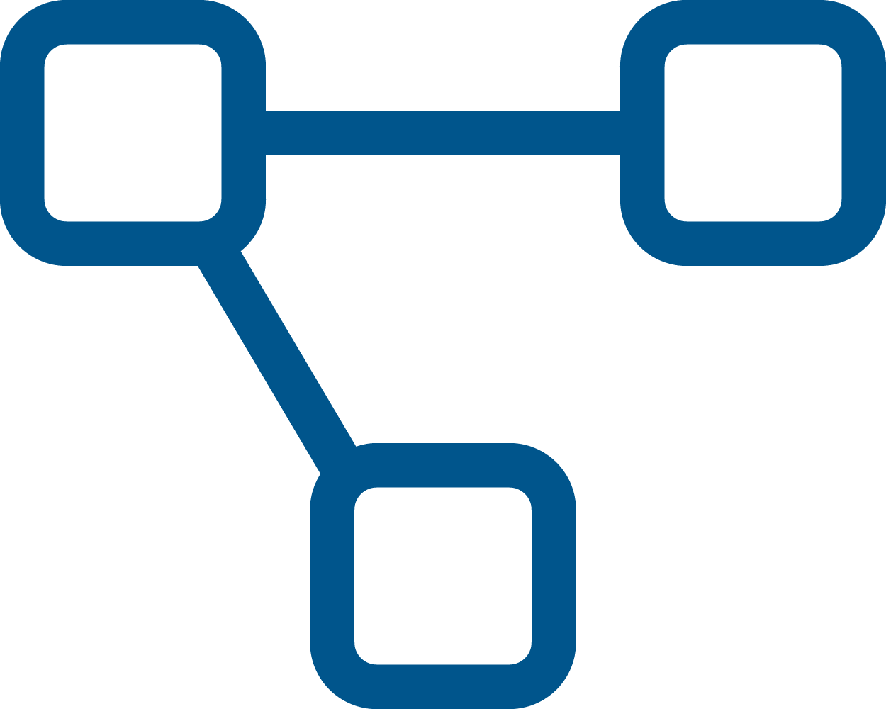

# Articoli associati

Nella tabella [ItemAssociated](../../integrazione/database-schema/itemassociated.md) è possibile definire associazioni di varie tipologie tra due articoli. Queste associazioni servono a facilitare la navigazione del catalogo all'utente.\
La visibilità di ogni tipo di associazione è regolata dalle autorizzazioni "Può vedere gli articoli alternativi", "Può vedere gli articoli correlati" e "Può vedere gli articoli sostitutivi".\
Le tre autorizzazioni sono presenti sia per ruoli B2b che per ruoli Agente.

### Articoli alternativi

Gli articoli alternativi sono prodotti con caratteristiche comuni. \
Quest'associazione serve a facilitare la ricerca di articoli simili, permettendo una veloce navigazione del catalogo tra articoli che sono alternativi.\
La presenza di articoli alternativi è segnalata dalla seguente icona . \
Le proprietà che estendono le associazioni già definite nella tabella sono la transitività (Se A è alternativo a B e alternativo a C automaticamente B è alternativo a C ) e la bidirezionalità (Se A è alternativo a B di conseguenza B è alternativo ad A).\
\
Nell'esempio riportato di seguito l'Articolo A è alternativo all'Articolo B e all'Articolo C; in tutti e 3 gli articoli verrà mostrata l'icona che rimanda agli altri due (A -> B e C, B -> A e C, C-> A e B).

| SourceItemId | AssociatedItemId |
| ------------ | ---------------- |
| Articolo A   | Articolo B       |
| Articolo A   | Articolo C       |

### Articoli Sostitutivi

Gli articoli sostitutivi sono solitamente utilizzati per segnalare un nuovo modello o un articolo che, per variabili motivi, non è più disponibile ed è quindi stato sostituito da un articolo simile.\
La presenza di articoli sostitutivi è segnalata dalla seguente icona  . Questa icona verrà visualizzata nell'articolo obsoleto e permetterà di accedere velocemente al/agli articolo/i che ne hanno preso il posto. Il formato dei dati inseriti prevede che l'articolo sorgente sia quello non più disponibile.\
\
Nell'esempio di dati riportato di seguito gli articoli ArticoloTerzaGenerazioneA ed ArticoloTerzaGenerazioneB hanno sostituito l'articolo ArticoloSecondaGenerazione; in quest'ultimo verrà raffigurata l'icona che rimanda ai due articoli ArticoloTerzaGenerazioneA ed ArticoloTerzaGenerazioneB.

| SourceItemId               | AssociatedItemId          |
| -------------------------- | ------------------------- |
| ArticoloSecondaGenerazione | ArticoloTerzaGenerazioneA |
| ArticoloSecondaGenerazione | ArticoloTerzaGenerazioneB |

### Articoli collegati

Gli articoli legati da questo tipo di associazione vengono spesso acquistati insieme: un esempio di articoli collegati può essere un prodotto con i suoi accessori.\
A differenza degli articoli alternativi il collegamento è unidirezionale: gli accessori sono collegati al prodotto, ma il prodotto non è collegato ai suoi accessori.\
L'icona che indica la presenza di articoli collegati è la seguente  . \
L'articolo in cui viene mostrata l'icona è quello principale. Prendendo come esempio un trapano con le sue punte, nel trapano sarà mostra l'icona e nelle punte no.\
\
Nell'esempio di dati riportato di seguito l'Articolo A risulta collegato agli accessori Accessorio1 ed Accessoio2; nel catalogo sarà quindi raffigurata l'icona che dal trapano rimanda ai due accessori.

| SourceItemId | AssociatedItemId |
| ------------ | ---------------- |
| Articolo A   | Accessorio1      |
| Articolo A   | Accessorio2      |

### Articoli raggruppati

Questo tipo di associazione modifica solo la visualizzazione di alcuni articoli; è supportata solo nel b2b e a differenza delle altre non associa due articoli, ma un articolo ad un gruppo.\
Per far si che questo tipo di associazione non venga ignorato serve aggiungere la regola di Business B2b\Item\GroupByAssociatedItems con il valore 1.\
A questo punto, nel b2b, gli articoli legati tra loro saranno visualizzati in gruppo.\
Nella tabella [ItemAssociated](../../integrazione/database-schema/itemassociated.md) dovremo avere il nome del gruppo nel campo SourceItemId e il codice articolo nel campo AssociatedItemId.\
\
Con il setup riportato di seguito avremo due gruppi di articoli composti rispettivamente da:\
Gruppo1 ->  Articolo A e Articolo B\
Gruppo2 -> Articolo C, Articolo D, Articolo E

| SourceItemId | AssociatedItemId |
| ------------ | ---------------- |
| Gruppo1      | Articolo A       |
| Gruppo1      | Articolo B       |
| Gruppo2      | Articolo C       |
| Gruppo2      | Articolo D       |
| Gruppo2      | Articolo E       |
