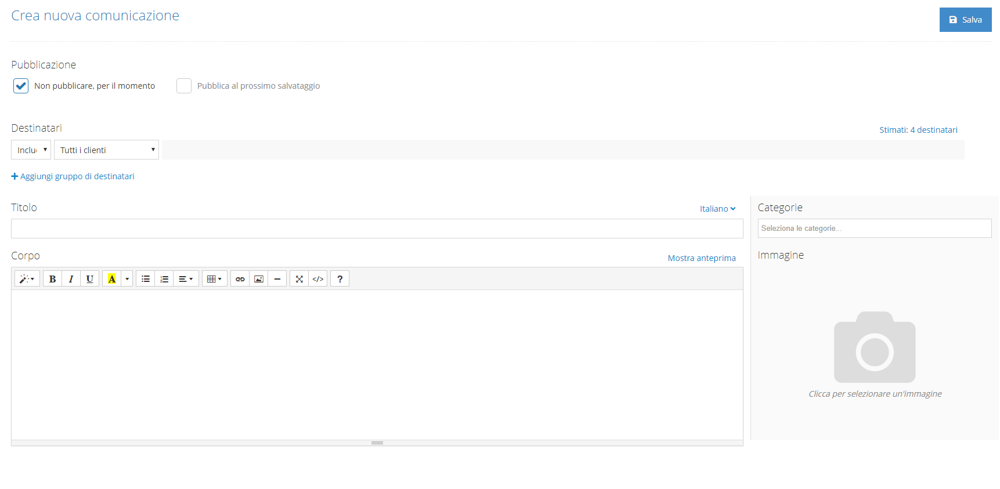
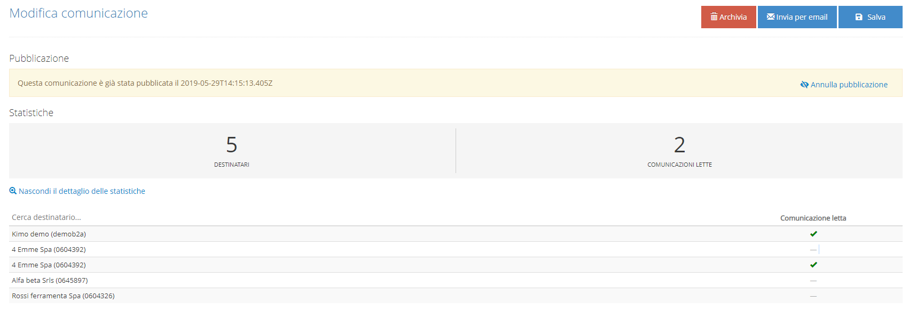

# Comunicazioni

Dal modulo Web App è possibile creare ed in modo automatizzato inviare delle comunicazioni ai vari utenti.  
Le comunicazioni create vengono visualizzate nello storico proposto, suddivise per Attive e Archiviate.  
Per creare una nuova comunicazione è presente l'apposito pulsante, situato in alto a destra della maschera proposta; cliccando sul pulsante si verrà reindirizzati all'editor della comunicazione.

La pagina visualizzata è suddivisa in 3 parti:

* Pubblicazione: È possibile scegliere se pubblicare subito la comunicazione che si sta configurando o se lasciarla in fase di attesa.
* Destinatari: È possibile selezionare i destinatari della comunicazione; viene proposto un meccanismo che ne facilita la selezione. È possibile scegliere se gli utenti selezionati devono essere inclusi o esclusi come destinatari.
* Comunicazione: È possibile inserire un titolo e un corpo del messaggio. Nel corpo del messaggio è possibile applicare modifiche stilistiche e aggiungere contenuti multimediali. Il corpo del messaggio inserito è inoltre visualizzabile sotto forma di HTML.  

### Statistiche

Accedendo ad una comunicazione che è stata pubblicata è possibile annullarne la pubblicazione ed eventualmente ripubblicarla in un secondo momento.   
Nella maschera visualizzata per le comunicazioni pubblicate viene visualizzata una parte di statistiche su gli utenti che l'hanno visualizzata \( Numero di utenti e più dettagliatamente Nome Utente/Cliente\).

### Pubblicazione e notifiche

Durante la pubblicazione di una comunicazione viene richiesto il tipo di notifica da inviare ai destinatari; in assenza di notifiche aggiuntive verranno comunque segnalate le comunicazioni non lette all'interno delle app SFA e B2B.  
I tipi di notifica aggiuntivi sono:

* Email: viene inviata una mail all'indirizzo associato all'utente Kimo
* Notifica push: Viene inviata una notifica sui device in cui è stato creato l'utente destinatario.  Per poter accedere a questa funzionalità è necessaria una configurazione da parte del team di [supporto tecnico](../contatti.md).


Quando si installa l'applicazione di Kimo viene richiesto il permesso di poter inviare notifiche al sistema operativo. Se non è stato garantito questo permesso è possibile aggiungerlo nelle impostazioni di iOS/Android.  
Le comunicazioni sono una funzionalità accessibile solo online.


 

