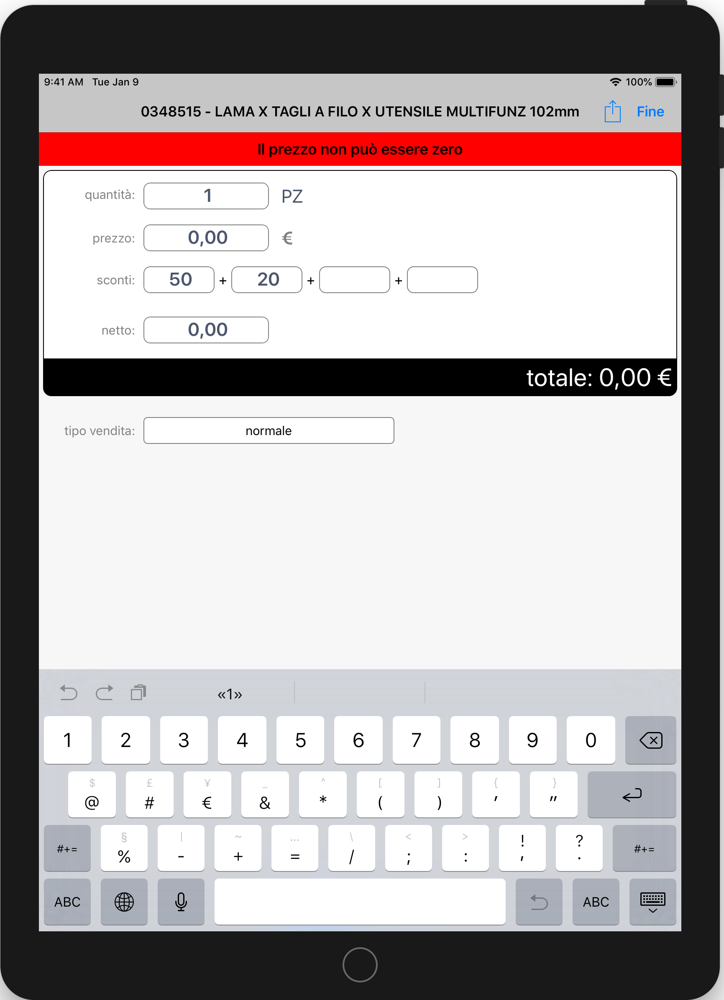
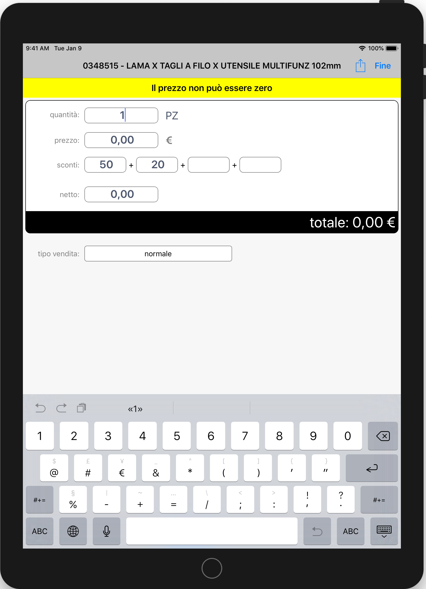

# Controlli commerciali

È possibile effettuare delle validazione all'interno della testata e delle righe del documento.  
Queste validazioni vanno configurate in fase di integrazione con l'Erp.  
Le tabelle a cui fare riferimento per la gestione di questi dati sono [SalesControlDocument](../../integrazione/database-schema/salescontroldocument.md) e [SalesControlDocumentLine](../../integrazione/database-schema/salescontroldocumentline.md).  
I messaggi di errore restituiti dalle validazione possono avere due livelli di severità, che indicano il comportamento da tenere in caso di fallimento validazioni.  
Le validazioni a livello di testata documento sono eseguite all'invio del Documento.  
I due livelli sono:

* Error: Viene dato un errore bloccante che impone di modificare i dati, senza modificare il prezzo non si potrà uscire dalla seguente pagina se non cancellando la riga

* Warning: Viene segnalato un messaggio che identificare la validazione fallita, la riga può comunque essere aggiunta e il documento inviato

