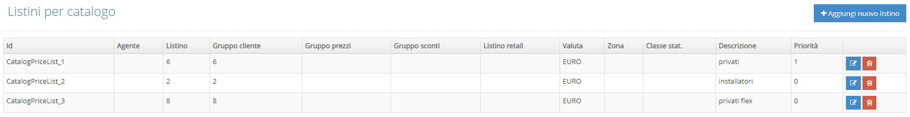
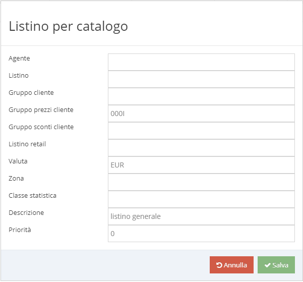

# Listini per catalogo \(TODO\)

In questa sezione è possibile definire i listini prezzi da utilizzare in base al contesto in cui ci si trova, un listino prezzi può essere attribuito in base a:

1. Agente
2. Gruppo Cliente
3. Gruppo Prezzi Cliente
4. Gruppo Sconti Cliente

Nel caso si presentino due condizioni che fanno riferimento a listini diversi, viene utilizzato il listino con priorità minore \(es: Priorità = 0 prevale su Priorità = 1\).

