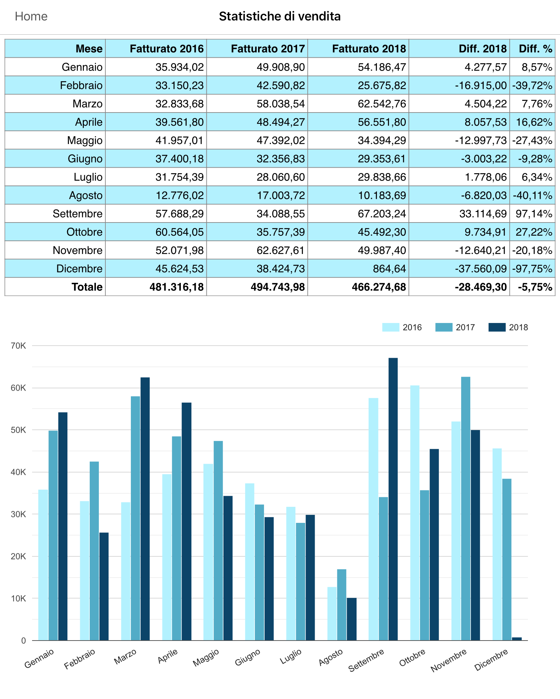

# Statistiche

In Kimo i dati statistici vengono gestiti sotto forma di json, questi dati sono successivamente deserializzati e renderizzati per essere visualizzati sotto forma di layout html negli iPad degli utenti SFA.

I dati nel formato json, devono essere inviati a Kimo nelle tabella AccountAccountingInfo o SalesAgent, i campi in cui mappare questi i dati sono i FreeText\(1..2..3..\).   
I dati presenti nella AccountAccountingInfo sono resi disponibile a livello di cliente, quindi tutti gli agenti che visualizzano il cliente associato alla statistica visualizzano lo stesso dato.  
I dati presenti nella SalesAgent invece sono resi disponibili a livello di agente, quindi ciascun agente potrà visualizzare solo le statistiche assegnategli.  
I layout da utilizzare vengono determinati dalla tabella ed il campo utilizzati, in particolare sono:  

*  AccountAccountinfInfoExtendedInfo\(1..2..3\)Layout 
* SalesAgentExtendedInfo\(1..2..3\)Layout

  
Il contesti da inserire quando si crea il layout per la visualizzazione vengono determinati allo stesso modo inserendo la parola Context al posto di Layout:  

* AccountAccountinfInfoExtendedInfo\(1..2..3\)Context
* SalesAgentExtendedInfo\(1..2..3\)Context

**Es**.  
Utilizzando la tabella SalesAgent e il campo FreeText2 si andrà ad utilizzare il layout SalesAgentExtendedInfo2Layout con contesto SalesAgentExtendedInfo2Context.

### Visualizzazione

Le statistiche posso essere visualizzate, oltre che in normali tabelle html, in grafici Google Chart.  
La visualizzazione dei grafici, renderizzati con Google Chart, è disponibile solo online.   
Di seguito riportiamo un grafico che  visualizza delle statistiche, calcolate su dati fittizi, evidenziando la differenza tra i fatturati degli ultimi 3 anni.



### Input

Il json ricevuto in input, deve rispettare le regole standard di validazione, altrimenti non è possibile deserializzarlo e successivamente andarlo a visualizzare.  
Di seguito riportiamo alcuni esempi di json  nel formato atteso:



```javascript
{
  "Statistiche": [
    {
      "Mese":"Gennaio",
      "Fatturato":1500.20,
      "Venduto": 2000.00
    },
    {
    "Mese":"Febbraio",
    "Fatturato":2343.34,
    "Venduto": 3000.00
    },
    {
    "Mese":"Marzo",
    "Fatturato":5435.00,
    "Venduto":5790.00
    },
    {
    "Mese":"Aprile",
    "Fatturato":4500.90,
    "Venduto":5700.85
    }
  ]
}
```





```javascript
{
  "ReportCustomersTot": [
    {
      "Fatt_LYTD": 66144.83,
      "Fatt_YTD": 69363.65,
      "Delta": 3218.82,
      "Delta_Perc": 4.87
    }
  ],
  "ReportCustomers": [
    {
      "Codice": "C0AA8040",
      "Valore": 111,2
    },
    {
      "Codice": "C00BVR72",
      "Valore": 111,2
    },
    {
      "Codice": "C0RTT750",
      "Valore": 111,2
    }
  ],
  "ReportCustomersToTot": [
    {
      "TO_LYTD": 37045.86,
      "TO_YTD": 19150.69,
      "Delta": -17895.17,
      "Delta_Perc": -48.31
    }
  ],
  "ReportCustomersTo": [
    {
      "Codice": "C0ABV364",
      "Valore": "TEST1"
    },
    {
      "Codice": "C00QRV982",
      "Cliente": "TEST2"
    },
    {
      "Codice": "C00$R%T90",
      "Cliente": "TEST3"
    }
  ]
}
```





```javascript
{
  "anno0": 2018,
  "anno1": 2017,
  "anno2": 2016,
  "mesi": [
    {
      "mese": "Gennaio",
      "importiAnno0": 54186.47,
      "importiAnno1": 49908.9,
      "importiAnno2": 35934.02,
      "diffImporti": 4277.57,
      "diffImportiPercentuale": 8.57075
    },
    {
      "mese": "Febbraio",
      "importiAnno0": 25675.82,
      "importiAnno1": 42590.82,
      "importiAnno2": 33150.23,
      "diffImporti": -16915,
      "diffImportiPercentuale": -39.71513
    },
    {
      "mese": "Marzo",
      "importiAnno0": 62542.76,
      "importiAnno1": 58038.54,
      "importiAnno2": 32833.68,
      "diffImporti": 4504.22,
      "diffImportiPercentuale": 7.76073
    },
    {
      "mese": "Aprile",
      "importiAnno0": 56551.8,
      "importiAnno1": 48494.27,
      "importiAnno2": 39561.8,
      "diffImporti": 8057.53,
      "diffImportiPercentuale": 16.61542
    },
    {
      "mese": "Maggio",
      "importiAnno0": 34394.29,
      "importiAnno1": 47392.02,
      "importiAnno2": 41957.01,
      "diffImporti": -12997.73,
      "diffImportiPercentuale": -27.42598
    },
    {
      "mese": "Giugno",
      "importiAnno0": 29353.61,
      "importiAnno1": 32356.83,
      "importiAnno2": 37400.18,
      "diffImporti": -3003.22,
      "diffImportiPercentuale": -9.28156
    },
    {
      "mese": "Luglio",
      "importiAnno0": 29838.66,
      "importiAnno1": 28060.6,
      "importiAnno2": 31754.39,
      "diffImporti": 1778.06,
      "diffImportiPercentuale": 6.3365
    },
    {
      "mese": "Agosto",
      "importiAnno0": 10183.69,
      "importiAnno1": 17003.72,
      "importiAnno2": 12776.02,
      "diffImporti": -6820.03,
      "diffImportiPercentuale": -40.10904
    },
    {
      "mese": "Settembre",
      "importiAnno0": 67203.24,
      "importiAnno1": 34088.55,
      "importiAnno2": 57688.29,
      "diffImporti": 33114.69,
      "diffImportiPercentuale": 97.14314
    },
    {
      "mese": "Ottobre",
      "importiAnno0": 45492.3,
      "importiAnno1": 35757.39,
      "importiAnno2": 60564.05,
      "diffImporti": 9734.91,
      "diffImportiPercentuale": 27.22488
    },
    {
      "mese": "Novembre",
      "importiAnno0": 49987.4,
      "importiAnno1": 62627.61,
      "importiAnno2": 52071.98,
      "diffImporti": -12640.21,
      "diffImportiPercentuale": -20.18312
    },
    {
      "mese": "Dicembre",
      "importiAnno0": 864.64,
      "importiAnno1": 38424.73,
      "importiAnno2": 45624.53,
      "diffImporti": -37560.09,
      "diffImportiPercentuale": -97.74978
    },
    {
      "mese": "Totale",
      "importiAnno0": 466274.68,
      "importiAnno1": 494743.98,
      "importiAnno2": 481316.18,
      "diffImporti": -28469.3,
      "diffImportiPercentuale": -5.75434
    }
  ]
}
```



