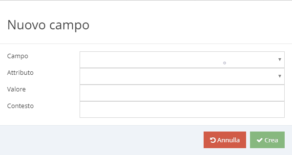

# Metadati sulle entità

In Kimo esistono entità di vario tipo:

* Entità in "sola lettura": importate dal Sistema Informativo (Erp, Crm, ...) e mai modificate in Kimo (es. Documenti da Erp, anagrafica dei metodi di pagamento, condizioni di vendita, ...).
* Entità creabili e/o modificabili nelle App di Kimo (es. clienti, documenti di vendita, incassi, ...).
* Entità di supporto creabili dalla [Console di Amministrazione](../introduzione/moduli/console-admin.md) di Kimo (es. i tipi di documenti di vendita, i tipi di attività, i tipi di riassortimento, FreeLookup, ...). Sono entità che gli utenti delle App di Kimo gestiscono in "sola lettura" e che non vengono esportate verso l'Erp.

I metadati in particolare si riferiscono alle entità creabili/modificabili dagli utenti attraverso le App di Kimo: definiscono per ciascun campo delle entità le regole di editing, come ad esempio la lunghezza massima per i campi di testo, l'obbligatorietà dell'inserimento di un determinato campo e così via.\
\
Se non vengono definiti i metadati per un'entità, i suoi campi risultano in sola lettura nelle App di Kimo.

### Metadati di entità

I metadati di entità definiscono i criteri di applicazione dei metadati di campo.

.png>)

#### Entità

Entità di riferimento.

#### Contesto

Il contesto specifica uno o più ambiti applicativi in cui il metadato si applica.\
Il contesto è espresso nel formato Json array ma la sintassi è diversa per ciascuna entità.

es. Entità= Document indica che il metadato si applica a tutti i documenti (Ordini, Offerte...).\
Contesto = \["Family=2", "Type=INITIAL"] indica che il metadato si applica all'entità Documento di tipo Offerta o Preventivo o a Documenti con stato non ancora assegnato.

| Entità                | Sintassi del Contesto                                                                                                                                                                                                                                                                       |
| --------------------- | ------------------------------------------------------------------------------------------------------------------------------------------------------------------------------------------------------------------------------------------------------------------------------------------- |
| Account               | Supportato solo un contesto: \["Prospect"]                                                                                                                                                                                                                                                  |
| Prospect              | Nessun contesto supportato.                                                                                                                                                                                                                                                                 |
| Activity              | Lista dei tipi di attività espressi come codice del tipo di attività es. \["VISITA", "FIERA"]                                                                                                                                                                                               |
| RecurrentActivity     | Nessun contesto supportato.                                                                                                                                                                                                                                                                 |
| Contact               | Nessun contesto supportato.                                                                                                                                                                                                                                                                 |
| BudgetLine            | Nessun contesto supportato                                                                                                                                                                                                                                                                  |
| ReceivableInstallment | Nessun contesto supportato                                                                                                                                                                                                                                                                  |
| Document              | 
Espresso nella forma ["Type=&#x3C;valore>", "Family=&#x3C;valore>"]

 Famiglia espressa come "Family=2" (1 per Ordini, 2 per Offerte)

Id Document es. "Type=DocumentType_1". Type può inoltre assumere il valore INITIAL che indica il documento non ancora tipizzato.
 |

#### Origine

L'attributo definisce l'applicazione del metadato in base all'origine del dato.\
Il parametro può assumere i seguenti valori:

* 0 = Erp
* 1 = Creata su Mobile
* 2 = Modificata su Mobile
* 3 = Creata in KimoSuite

#### Padre

Se l'attributo Padre è non valorizzato, il metadato è considerarsi base per l'entità specificata.\
Se l'attributo \*\*\*\* Padre è valorizzato con "Base" il metadato estende il metadato base definito per dell'entità.\
\
Immaginiamo che per l'entità DocumentLine sia definito un metadato base con una serie di regole di editing che non prevedono la possibilità di alterare il prezzo.\
Se per la stessa entità voglio concedere, solo ad una certa categoria di utenti, la possibilità di modificare il prezzo, posso definire un nuovo metadato per l'entità DocumentLine che referenzia il metadato base e che concede l'autorizzazione alla lista di utenti desiderati.\
In questo modo è possibile gestire in modo centralizzato le regole di editing di una certa entità, ed estenderle se necessario ad una specifica categoria di utilizzatori, operando semplicemente per aggiunta.

#### Utenti/Agenti/Ruoli

Indica che i metadati specificati per l'entità si applicano solo ad una lista di utilizzatori.\
E' possibile specificare per ciascuna tipologia di utilizzatori una lista multipla di elementi.

.png>)

Se l'attributo non è valorizzato le regole si applicano a tutti gli utilizzatori.

### Metadati di campo

Un metadato sul campo definisce se un campo può essere sottoposto ad aggiornamento e quali vincoli deve rispettare.

Ad un Campo possono essere applicate una o più regole di editing.

| Attributo         | Descrizione                                                                                                                                                                        | Tipo             |
| ----------------- | ---------------------------------------------------------------------------------------------------------------------------------------------------------------------------------- | ---------------- |
| Editabile         | 
Indica se il campo può essere modificato. Può assumere i valori: 0=No 1=Si.
                                                                                              | bool             |
| Lunghezza Massima | Applicabile solo per i campi di tipo string. Indica la lunghezza massima che può assumere il valore.                                                                               | int              |
| Resettabile       | 
Indica se deve essere visibile il tasto "Reset" che consente di azzerare il campo. Può assumere i valori: 0=No 1=Si.
                                                     | bool             |
| Nullable          | 
Indica se il campo può essere impostato a NULL. Può assumere i valori: 0=No 1=Si.
                                                                                        | bool             |
| Obbligatorietà    | 
Indica se la valorizzazione del campo è obbligatoria. Può assumere i valori: 0=No 1=Si.
                                                                                  | bool             |
| Pattern Regex     | 
Indica un'espressione regolare verificata in fase di salvataggio dell'entità. La sintassi da usare è quella del linguaggio C#. es. controllo sul numero di telefono (^$)
 | (^\[0-9]{1,14}$) |

#### **Contesto**

Vedi il paragrafo [Contesto](entity-metadata.md#contesto).
