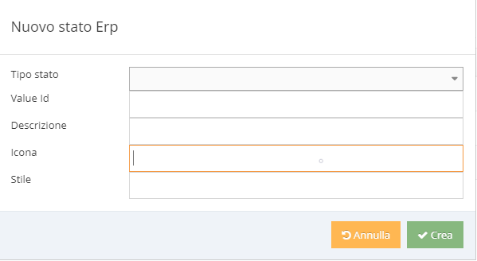

# Stati Erp

Una lista di stati erp è un elenco di coppie di valori: codice, descrizione in cui ciascuna coppia identifica uno stato.\
Ciascun stato erp ha un attributo "Tipo Stato" nella forma \<Entity>\<Index> che identifica l'Entity di riferimento ed il campo rispettivo Es. Item.ErpStatus1.\
Data un' entità con uno dei campi ErpStatus\<Index> valorizzato, se per ciascun valore del campo ErpStatus\<Index>, non è possibile determinare il valore corrispondente in stati erp, la fase di caricamento si interrompe con un errore.\
Per ciascun stato erp è possibile inoltre definire: lo stile (in formato CSS) e un codice che identifica l'icona da visualizzare (supporto a Font Awesome).&#x20;

Es. Disponibilità Item

| Tipo Stato | Value Id | Descrizione     |  Icona | Anteprima                                                           | Stile                                                           |
| ---------- | -------- | --------------- | ------ | ------------------------------------------------------------------- | --------------------------------------------------------------- |
| Item1      | Rosso    | Non disponibile | \uf165 | 
 

 | color: #FF0000; font-family: FontAwesomeRegular; font-size: 20; |
| Item1      | Giallo   | In arrivo       | \uf107 |                                    | color: #FFD300; font-family: FontAwesomeRegular; font-size: 20; |
| Item1      | Verde    | Disponibile     | \uf164 | 
 

   | color: #009933; font-family: FontAwesomeRegular; font-size: 20; |
