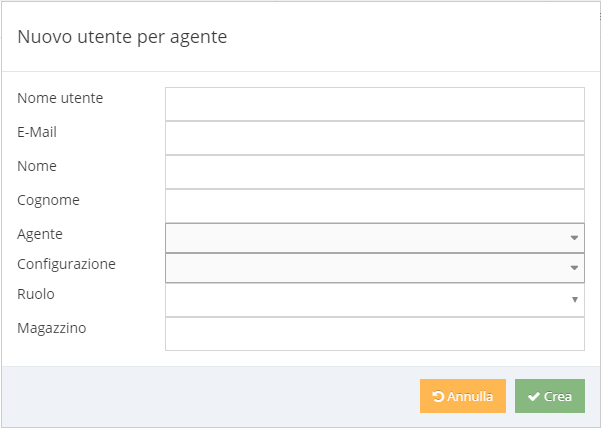

# Creare un utente per SFA

Per creare un nuovo utente di tipo Agente, accedere alla Console di Amministrazione di Kimo \(es. [https://kimo.mycompany.com/admin](https://kimo.mycompany.com/admin)\), selezionare l'area "Utenti", quindi "Nuovo utente per agente" e compilare tutti i campi nella maschera che sarà visualizzata:

**Nota bene**: 

1. l'indirizzo mail deve essere univoco, in quanto è utilizzato per la conferma di attivazione dell'utente e può essere usato per funzioni come il reset della password.
2. È possibile creare più utenti per uno stesso agente.

Il campo "Agente" è da selezionare nell'elenco degli agenti abilitati dal sistema informativo e, quindi, attivabili in Kimo: permette di collegare l'utente di Kimo con il codice agente del sistema informativo.  
Se l'agente desiderato non è presente in elenco, verificare che tali informazioni siano state importate correttamente dal sistema informativo.

Il campo "[Ruolo](../ruoli.md)" è da selezionare nell'elenco dei ruoli definiti in Kimo e che abilitano le diverse funzionalità.

Una volta premuto il pulsante "Crea" viene creato l'utente ed inviata una mail all'indirizzo inserito nel campo "E-mail" contenente il link tramite cui impostare la password ed attivare l'utente.  
Fino a quando l'utente non è attivo non è possibile effettuare alcuna operazione.

Finché l'utente non viene attivato, nella lista utenti sono visibili i seguenti pulsanti  e  che  
permettono di inviare nuovamente la mail di attivazione oppure di accedere direttamente al link di attivazione \([Attivare un utente](attivazione-di-un-utente.md)\).

L'utente può essere "cancellato" premendo il tasto  \([Cancellare e ripristinare un utente](archiviazione-e-ripristino.md)\).

Successivamente alla creazione del nuovo utente, accedere alla maschera di dettaglio \(tramite il pulsantepresente nella lista degli utenti\) per impostare le ulteriori informazioni \(es. layout, serie numeratore, ...\) come da maschera seguente:

Al termine della creazione dell'utente è necessario effettuare una "Preparazione dati di sync"; per fare ciò selezionare dal menù in alto a destra la voce "Import" e successivamente eseguire lo step 3 \(Preparazione dati di sync\). Questa procedura può essere di durata variabile in base ai dati presenti nel database \(solitamente compresa tra i 15 e i 30 minuti\).

