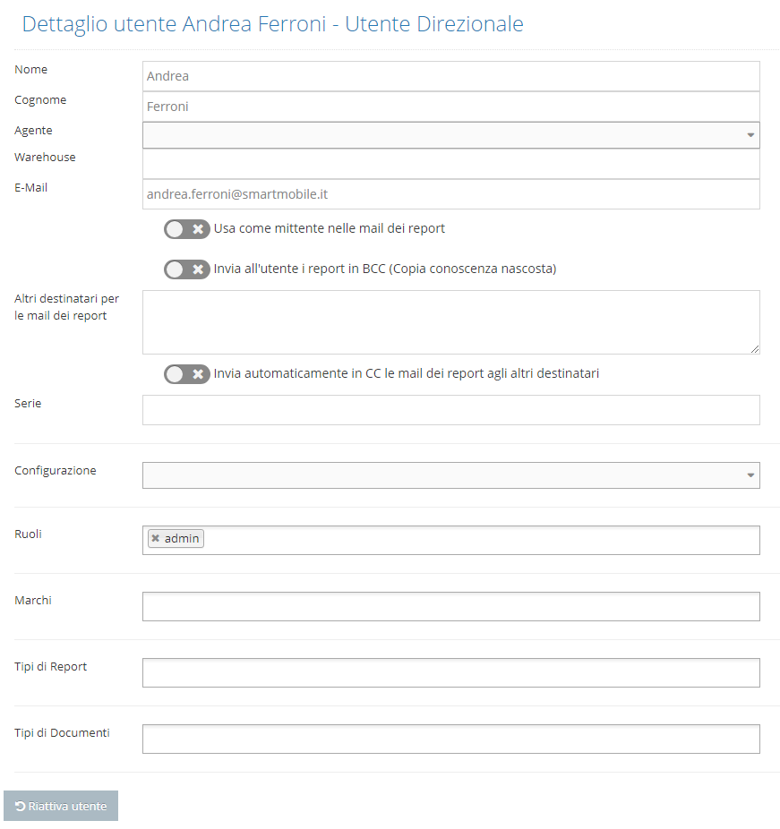

# Creare un nuovo utente direzionale

Per creare un nuovo utente di tipo direzionale, accedere alla console di amministrazione di Kimo \(es. [https://kimo.mycompany.com/admin](https://kimo.mycompany.com/admin)\), selezionare l'area "Utenti", quindi "+ Nuovo utente direzionale" e compilare tutti i campi nella maschera che sarà visualizzata:

**Nota bene**

1. l'indirizzo mail deve essere univoco, in quanto è utilizzato per la conferma di attivazione dell'utente e può essere usato per funzioni come il reset della password.

Il campo "ruolo" è da selezionare nell'elenco dei ruoli definiti in Kimo e che abilitano le diverse funzionalità.  
Una volta premuto il pulsante "Crea" sarà creato l'utente ed inviata una mail all'indirizzo inserito nel campo "E-mail" contenente il link tramite cui impostare la password ed attivare l'utente.

Finché l'utente non è attivato nella lista utenti sono visibili i seguenti pulsanti  e  che  
permettono di inviare nuovamente la mail di attivazione oppure di accedere direttamente al link di attivazione.

L'utente può essere "cancellato" premendo il tasto  ma la cancellazione è di tipo logico infatti l'utente viene considerato archiviato. Se necessario un utente archiviato può essere ripristinato contattando il supporto tecnico.

Successivamente alla creazione del nuovo utente, accedere alla maschera di dettaglio \(tramite il pulsantepresente nella lista degli utenti\) per impostare le ulteriori informazioni \(es. layout, serie numeratore, ...\) come da maschera seguente:

Il pulsante  permette di ripetere il ciclo di attivazione dell'utente.

