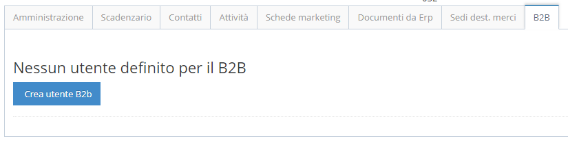
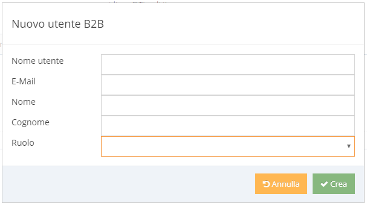

# Creare un utente per B2B \(utente di tipo Cliente\)

Per creare un nuovo utente di tipo Cliente, accedere alla [WebApp](../../introduzione/moduli/kimo-sfa.md#webapp-con-funzioni-per-utenti-direzionali) come utente Direzionale, selezionare l'area "Clienti", aprire il dettaglio del Cliente che si vuole abilitare per il B2B, cliccare sulla sezione "B2B", premere il tasto "Crea utente B2b" e compilare tutti i campi nella maschera che viene visualizzata.

L' utente appena creato sarà visibile anche nella [Console di Amministrazione](../../introduzione/moduli/console-admin.md).

