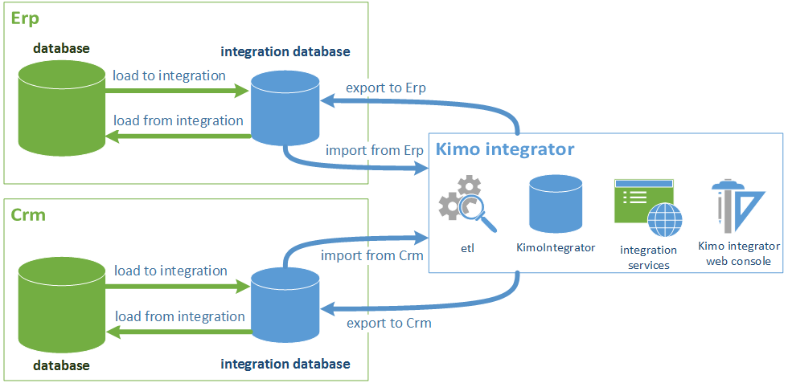

# Integrazione

## Introduzione <a href="#introduzione" id="introduzione"></a>



Kimo usa un ETL (extract, transform, load) proprietario per accedere ai dati su database relazionali, con accesso via ODBC e OleDB.

Si consiglia l’adozione di un database di integrazione (o **integration database**) dove il sistema informativo rende disponibile in lettura a Kimo i propri dati (tramite tabelle e/o viste), e dove Kimo scrive i dati di ritorno (tabelle), tutto secondo le seguenti fasi:

#### **Export dei dati da Erp/Crm a integration database (load to integration)** <a href="#export-dei-dati-da-erp-crm-a-integration-database-load-to-integration" id="export-dei-dati-da-erp-crm-a-integration-database-load-to-integration"></a>

Il sistema informativo si occupa di trasferire i dati verso il database di integrazione, così da renderli disponibili a Kimo Integrator (database che normalizza e verifica i dati per l'utilizzo in Kimo) .

Tale operazione, gestita dal sistema informativo con i propri metodi, deve rendere disponibile la situazione completa dei dati (e non differenziale o incrementale): Kimo necessita di leggere dal database di integrazione sempre tutti i dati che si vogliono rendere disponibili verso gli applicativi client (mobile/web).

#### **Import dati da integration database a Kimo (Integrator) (import from Erp/Crm)** <a href="#import-dati-da-integration-database-a-kimo-integrator-import-from-erp-crm" id="import-dati-da-integration-database-a-kimo-integrator-import-from-erp-crm"></a>

Kimo Integrator legge dal database di integrazione i dati resi disponibili dal sistema informativo, effettua una trasformazione (normalizzazione) dei dati per renderli “compatibili” con il proprio “database schema” e li carica nelle proprie tabelle: successivamente prepara i dati per gli utenti di tipo agente, secondo le logiche definite.

#### **Export dati di Kimo (Integrator) a integration database (export to Erp/Crm)** <a href="#export-dati-di-kimo-integrator-a-integration-database-export-to-erp-crm" id="export-dati-di-kimo-integrator-a-integration-database-export-to-erp-crm"></a>

Kimo (Integrator) scrive nel database di integrazione i dati provenienti dai sistemi mobile e web (es. nuovi ordini, nuovi clienti, …). In questa fase Kimo va in append nelle tabelle, secondo le modalità meglio descritte in seguito.

#### **Import dati da integration database all’Erp/Crm (load from integration)** <a href="#import-dati-da-integration-database-allerp-crm-load-from-integration" id="import-dati-da-integration-database-allerp-crm-load-from-integration"></a>

Il sistema informativo legge dal database di integrazione i dati scritti da Kimo (Integrator) per caricarli all’interno delle proprie strutture dati: a sua discrezione può cancellare i dati inviati da Kimo o marcarli come “letti”.

## Nozioni base <a href="#nozioni-base" id="nozioni-base"></a>

### Utilizzo dei soli campi e tabelle necessarie <a href="#utilizzo-dei-soli-campi-e-tabelle-necessarie" id="utilizzo-dei-soli-campi-e-tabelle-necessarie"></a>

Nel tracciato sono presenti numerose tabelle, ognuna con numerosi campi: non è necessario gestire il mapping di tutte le tabelle o di tutti i campi per una singola tabella, ma solo quelli che si intendono gestire (seguendo la regola al successivo punto "utilizzo tabelle anagrafiche").

Nel database di interscambio possono essere create le sole tabelle che interessano Erp e/o Crm, con i relativi campi effettivamente utilizzati, evitando così di inserire molti elementi che rimarrebbero inutilizzati. La non definizione di alcuni campi all’interno del database di interscambio non determinerà errori.

Allo stesso modo, quando Kimo inserirà nel database di interscambio i dati provenienti dai device mobile (nuovi documenti, …), salverà nelle tabelle solamente i dati per i campi definiti.

In questo modo si evitano sia il lavoro iniziale di definizione di tabelle e campi che non sarebbero utilizzati, sia l’aggiornamento del database di interscambio ad ogni modifica del suo tracciato riguardante campi non usati da Erp e/o Crm.

### Utilizzo tabelle anagrafiche <a href="#utilizzo-tabelle-anagrafiche" id="utilizzo-tabelle-anagrafiche"></a>

Per i campi valorizzati che rappresentano delle chiavi esterne verso altre tabelle anagrafiche, è sempre necessario definire la relativa anagrafica.

Esempio: la tabella “anagrafica clienti” (Account) presenta la chiave esterna per il “codice pagamento” (PaymentMethodId), che fa riferimento alla tabella “anagrafica pagamenti” (PaymentMethod); se il campo “codice pagamento” è utilizzato, sarà necessario valorizzare anche la relativa tabella “anagrafica pagamenti”.

### Tipi di dati e dimensioni <a href="#tipi-di-dati-e-dimensioni" id="tipi-di-dati-e-dimensioni"></a>

I campi indicati nel seguente tracciato hanno un tipo (TYPE) ed una dimensione (SIZE). I tipi di dati gestiti sono:

* testo (text): campo testuale lungo il numero di caratteri specificato in SIZE
* numerico (dec): la dimensione SIZE rappresenta il numero di interi e decimali (Es. 7,2 indica 7 interi e 2 decimali)
* intero (int)
* flag (bool): valore numerico di una (1) cifra. Può contenere i valori 0 / 1 (rappresentati Falso / Vero o No / Si)
* data (dt): campo datetime.

### Valorizzazione di default dei campi del database  <a href="#valorizzazione-di-default-dei-campi-del-database" id="valorizzazione-di-default-dei-campi-del-database"></a>

Tutti i campi utilizzati devono essere valorizzati con un valore di default. Salvo diverse indicazioni presenti nel tracciato seguente, si conviene l’utilizzo dei seguenti valori:

* per campi testuali: “blank” (stringa vuota)
* per campi numerici (prezzi, sconti, ecc..): “0”
* per campi di tipo date / orari: “-1”
* per campi di tipo flag (“0” / “1”): valore “0”

## Semafori per sincronizzazione operazioni import/export <a href="#semafori-per-sincronizzazione-operazioni-import-export" id="semafori-per-sincronizzazione-operazioni-import-export"></a>

L’utilizzo dei “semafori” consente di evitare la sovrapposizione delle operazioni di import/export fra l’Erp e Kimo, per consentire sempre il corretto allineamento dei dati.

Al fine di sincronizzare le operazioni di import/export in Kimo, saranno utilizzate 2 (due) tabelle di tipo semaforo le quali veranno create nel database di interscambio (integrator database):

* **ImportFromErpSemaphore** per il flusso di import
* **ExportToErpSemaphoreper** il flusso di export

#### nome tabella: ImportFromErpSemaphore / ExportToErpSemaphore <a href="#nome-tabella-importfromerpsemaphore-exporttoerpsemaphore" id="nome-tabella-importfromerpsemaphore-exporttoerpsemaphore"></a>

| field name | description              | type | size |
| ---------- | ------------------------ | ---- | ---- |
| Status     | flag di sincronizzazione | int  | 1    |

**note:**

il campo **Status** può assumere i seguenti valori:

* **0**: nessuna operazione in corso
* **1**: export dati da parte dell’ERP nel database di integrazione
* **2**: import dati da parte di Kimo dal database di integrazione
* **3**: export dati da parte di Kimo nel database di integrazione
* **4**: import dati da parte dell’ERP dal database di integrazione

## Import da Erp / Crm <a href="#import-da-erp-crm" id="import-da-erp-crm"></a>

È possibile richiamare l'operazione di import dei dati da Erp / Crm Integrator attraverso una chiamata a webservice oppure attraverso la console di amministrazione di Kimo.











```
```



## Export a Erp / Crm <a href="#export-a-erp-crm" id="export-a-erp-crm"></a>

È possibile richiamare l'operazione di export dei dati verso Erp / Crm Integrator attraverso una chiamata a webservice oppure attraverso la console di amministrazione di Kimo.











```
```


