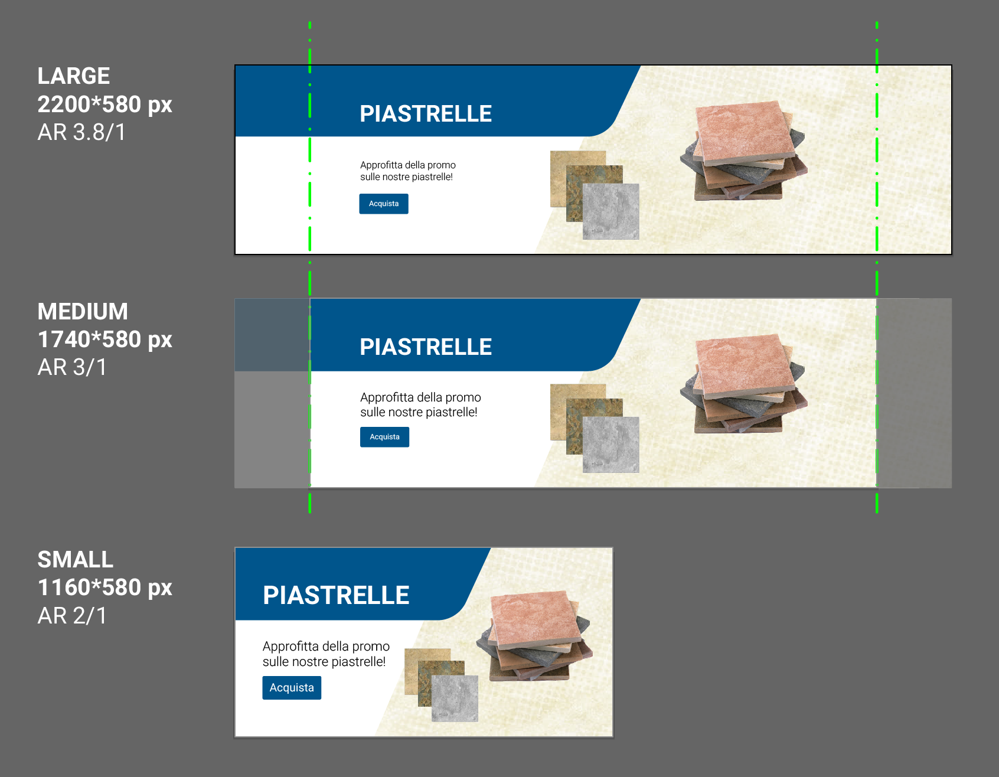

# Risorse grafiche per Kimo B2B

## Risorse per la pubblicazione sugli store \(App Store, Play Store\)

**1.Icona \(icon.png\)**

Viene usata come icona dell'app scarica dagli store  
_Dimensione: 1024x1024 px  
Risoluzione: 150 DPI  
Formato: immagine PNG **senza** trasparenza_

Nel caso si vogliano implementare icone differenti per iOS e Android, fornire due file \(es. "icon iOS.png" e "icon Android.png"\).

_**Nota bene: evitare dettagli che potrebbero perdere di qualità con l'abbassarsi della risoluzione.**_

## Risorse per Kimo B2B

Le risorse grafiche per Kimo B2B \(loghi, vetrina...\) sono le seguenti:

**1. Logo \(logo.png\)**

Viene usato nella maschera di login  
_Dimensione: 1000x500 px  
Risoluzione: 72 DPI  
Aspect ratio: 2:1  
Formato: immagine PNG con trasparenza_

**2. Logo Visual \(logo\_visual.png\)**

Viene usato nel menù laterale dell'app, per le risoluzioni "large" o "medium"  
_Dimensione: 100x100 px  
Risoluzione: 72 DPI  
Aspect ratio: 1:1  
Formato: immagine PNG con trasparenza_

**3. Immagini sezioni**

Viene usato nella sezione "categorie" della home e nel wizard del catalogo  
_Dimensione: 690x300 px  
Risoluzione: 72 DPI  
Aspect ratio: 2.3:1  
Formato: immagine PNG con trasparenza_

**4. Immagini sezioni \(metà altezza\)**

Viene usato nella sezione "---" della home.  
_Dimensione: 690x150 px  
Risoluzione: 72 DPI  
Aspect ratio: 4.6:1  
Formato: immagine PNG con trasparenza_

**5. Immagini carousel home**

Viene usato nella sezione "carosello" della home

### Risoluzione "large"

_Dimensione: 2200x580 px  
Risoluzione: 150 DPI  
Aspect ratio 3.8:1  
Formato: immagine PNG **senza** trasparenza_

### Risoluzione "medium"

_Dimensione: 1740x580 px  
Risoluzione: 150 DPI  
Aspect ratio: 3:1  
Formato: immagine PNG **senza** trasparenza_

### Risoluzione "small"

_Dimensione: 1160x580 px  
Risoluzione: 150 DPI  
Aspect ratio: 2:1  
Formato: immagine PNG **senza** trasparenza_

\_\_

