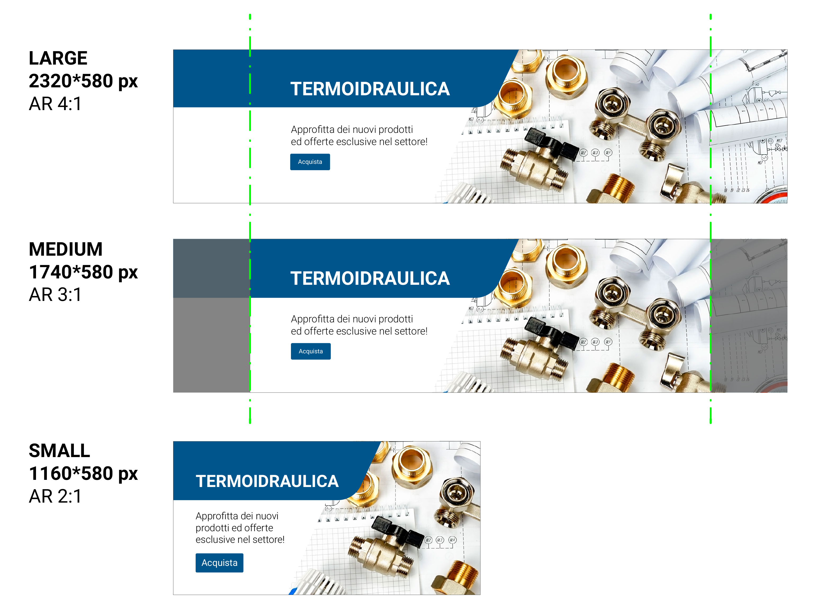

# Risorse grafiche per Kimo B2B

## In questa pagina

1. [Risorse per la pubblicazione sugli store (App Store, Play Store)](risorse-grafiche-per-kimo-b2b.md#risorse-per-la-pubblicazione-sugli-store-app-store-play-store)
2. [Risorse per Kimo B2B (loghi, sezioni e vetrina home, ...)](risorse-grafiche-per-kimo-b2b.md#risorse-per-kimo-b2b)
3. [Personalizzazione immagine di default per gli articoli che non hanno un'immagine](risorse-grafiche-per-kimo-b2b.md#personalizzazione-immagine-di-default-per-gli-articoli-che-non-hanno-unimmagine)

## Risorse per la pubblicazione sugli store (App Store, Play Store)

**1.Icona (icon.png)**

Viene usata come icona dell'app scarica dagli store\
_Dimensione: 1024x1024 px_\
_Risoluzione: 150 DPI_\
_Formato: immagine PNG **senza** trasparenza_

Nel caso si vogliano implementare icone differenti per iOS e Android, fornire due file (es. "icon iOS.png" e "icon Android.png").

_**Nota bene: evitare dettagli che potrebbero perdere di qualità con l'abbassarsi della risoluzione.**_

## Risorse per Kimo B2B

Le risorse grafiche per Kimo B2B (loghi, vetrina...) sono le seguenti:

**1. Logo (logo.png)**

Viene usato nella maschera di login\
_Dimensione: 1000x500 px_\
_Risoluzione: 72 DPI_\
_Aspect ratio: 2:1_\
_Formato: immagine PNG con trasparenza_

**2. Logo Visual (logo\_visual.png)**

Viene usato nel menù laterale dell'app, per le risoluzioni "large" o "medium"\
_Dimensione: 100x100 px_\
_Risoluzione: 72 DPI_\
_Aspect ratio: 1:1_\
_Formato: immagine PNG con trasparenza_

**3. Immagini sezioni**

Viene usato nella sezione "categorie" della home e nel wizard del catalogo\
_Dimensione: 690x300 px_\
_Risoluzione: 72 DPI_\
_Aspect ratio: 2.3:1_\
_Formato: immagine PNG con trasparenza_

**4. Immagini sezioni (metà altezza)**

Viene usato nella home.\
_Dimensione: 690x150 px_\
_Risoluzione: 72 DPI_\
_Aspect ratio: 4.6:1_\
_Formato: immagine PNG con trasparenza_

**5. Immagini carousel home**

Viene usato nella sezione "carosello" della home

### Risoluzione "large"

_Dimensione: 2320x580 px_\
_Risoluzione: 150 DPI_\
_Aspect ratio 4:1_\
_Formato: immagine PNG **senza** trasparenza_

### Risoluzione "medium"

_Dimensione: 1740x580 px_\
_Risoluzione: 150 DPI_\
_Aspect ratio: 3:1_\
_Formato: immagine PNG **senza** trasparenza_

### Risoluzione "small"

_Dimensione: 1160x580 px_\
_Risoluzione: 150 DPI_\
_Aspect ratio: 2:1_\
_Formato: immagine PNG **senza** trasparenza_

## Personalizzazione immagine di default per gli articoli che non hanno un'immagine

Può essere utilizzata un'immagine personalizzata inserendo il file "itemDefault.png" nella cartella "server\Sites\B2b\Custom\images".
