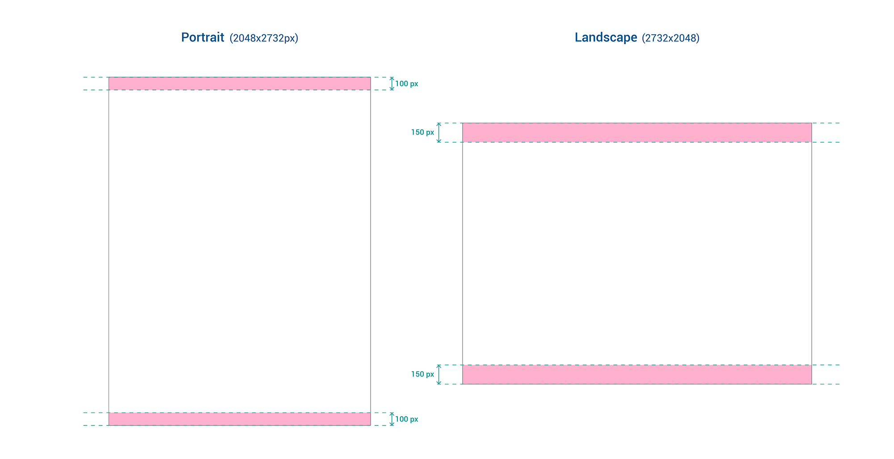

# Immagine di sfondo su Home Page

Su Kimo SFA è possibile personalizzare lo sfondo visualizzato nella Home Page dell'iPad.

## Configurazione


Le immagini di sfondo dovranno essere create per le risoluzioni standard dell’iPad elencate di seguito, ma vista l’ampia gamma di risoluzioni dei vari iPad alcune parti delle immagini potrebbero venire tagliate. **Suggeriamo perciò di non inserire, nelle aree indicate nel template, contenuti importanti che altrimenti potrebbero essere tagliati.**




1. creare 6 immagini con le seguenti risoluzioni e nomi:

   1. 1366x1024 - CompanyBgLandscape-iPad.png
   2. 2732x2048 - CompanyBgLandscape-iPad@2x.png
   3. 4098x3072 - CompanyBgLandscape-iPad@3x.png
   4. 1024x3072 - CompanyBgPortrait-iPad.png
   5. 2048x2732 - CompanyBgPortrait-iPad@2x.png
   6. 3072x4098 - CompanyBgPortrait-iPad@3x.png

2. Salvare le immagini nella cartella "{Istanza Kimo}\Public\Files\Resources".
3. Durante la sincronizzazione le immagini saranno scaricate in Kimo iPad.


Se si è già loggati su Kimo sul device \(ovvero non è la prima sincronizzazione\), sarà necessario uscire da Kimo e rientrare per vedere le immagini.


