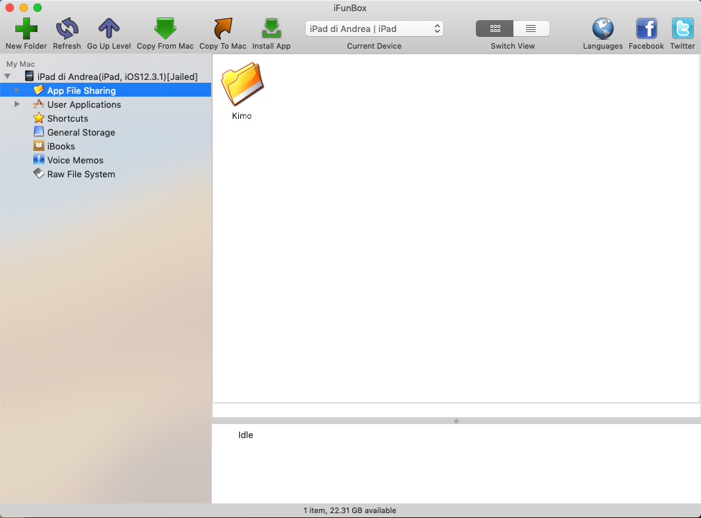

# Layout

In Kimo uno Use Case Context identifica un modello dati accessibile da una maschera.  
In Kimo la lista degli Use Case Context è predefinita.  
Un Layout è uno schema di visualizzazione di uno Use Case Context.  
In Kimo per ciascun Use Case Context esiste un Layout di Default che viene utilizzato in assenza di Layout personalizzati.  
In Kimo per un Use Case Context è possibile definire uno o più Layout personalizzati alternativi a quello di Default.  
In Kimo un Layout può essere utilizzato per visualizzare Use Case Context diversi ma tra loro simili.  
Un Layout può essere definito in formato XHTML o HTML \(vedi [Motore di template \(Template Engine\)](../../../impostazioni/template-engine.md)\).  
Una Configurazione è un elenco di Layout.  
In Kimo possono essere definite più Configurazioni, ma ciascun utente può vedere solo quella assegnata.  
Per ottenere dettagli sui Layout Kimo consultare [Layout SFA](list/).

Per un Layout è possibile definire l'altezza della Form, ciò è particolarmente utile nei casi in cui il Layout renderizza la riga di una lista.

Nella definizione di un Layout è possibile definire sia i Field che le relative Label.  
Il nome del Field identifica univocamente un campo del Modello Dati dello Use Case Context.  
La Label è una etichetta utilizzata per descrive il Field e fornisce un significato applicativo al Field.

### Rule: regole per la formattazione dinamica degli elementi

Ciascun Use Case Context dispone di una serie di Rule predefinite.  
Una Rule è una condizione logica che può assumere un valore booleano: TRUE o FALSE.  
Nel corpo del Layout per ciascun elemento è possibile definire una serie di modifiche stilistiche che debbono applicare solo se la combinazione logica in AND della lista di Rule a cui si fa riferimento è TRUE.  
~~~~Nell'esempio sottostante è riportato un Layout per lo UseCaseContext "AccountSearchContext".  
Le Rule utilizzate sono: "HasExpiredInstallments" e "HasUnpaidInstallments".  


```markup
<form type='free' height='120'>	
    <rulegroup id='ruleExpiredInstallments' rules='HasExpiredInstallments'  />
    <rule id='HasExpiredInstallments' style='color : red' />  
    <rulegroup id='ruleUnpaidInstallments' rules='HasUnpaidInstallments'  />
    <rule id='HasUnpaidInstallments' style='color : red' />    	

    <field x='5'   y='5'  width='90'  height='50' id='Code' 	    style='color:black; font-size:13; font-weight : normal' />
    <field x='100' y='5'  width='570' height='50' id='Name' 	    style='color : black; font-size : 15; font-weight : bold'/>   
    <field x='620' y='5'  width='150'  height='50' id='FreeLookup1Description' style='color:black; font-size:13; font-weight : normal' /> 
    <field x='5'   y='45' width='340' height='40' id='Address'      style='color : black; font-size : 15;'/> 
    <label x='5'   y='85' width='80'  height='30' text='scaduto:'   style='color : gray; font-size : 15' rulegroup='ruleExpiredInstallments' />
    <field x='70'  y='85' width='100' height='30' id='ExpiredInstallmentsAmount' style='color : gray; font-size : 15' rulegroup='ruleExpiredInstallments' />
    <label x='350' y='45' width='80'  height='30' text='telefono:'  style='color : gray; font-size : 15' />
    <field x='420' y='45' width='150' height='30' id='Phone'        style='color : black; font-size : 15' />
    <label x='350' y='65' width='80'  height='30' text='e-mail 2:'    style='color : gray; font-size : 15' />
    <field x='420' y='65' width='270' height='30' id='Mail'         style='color : red; font-size : 18' />
    <label x='350' y='85' width='80'  height='30' text='insoluti:'  style='color : gray; font-size : 15' rulegroup='ruleUnpaidInstallments' />
    <field x='430' y='85' width='100' height='30' id='UnpaidInstallmentsAmount' style='color : gray; font-size : 15' rulegroup='ruleUnpaidInstallments' />
</form>
```

### Contesto: esclusione di elementi in base allo Use Case Context

Nel corpo del Layout in corrispondenza a ciascun elemento è possibile specificare il Contesto \(Use Case Context\) in corrispondenza del quale l'elemento deve essere reso visibile.  
Questo meccanismo rende possibile il riutilizzo di uno stesso Layout per Use Case Context diversi ma simili tra loro.

Nell'esempio sottostante è riportato un Layout di esempio.  
Si noti il Field "Document\_NetUnitPrice", la presenza dell'attributo "contesto" indica che quando il Layout è aperto nel contesto originale il Field è **invisibile**, quando lo stesso Layut è aperto nel contesto "Document.Added" il Field è **visibile**.

```markup
<form type='free' height='120'>
<field x='450'  y='0' width='44' height='44' id='PromotionStatusIcon'/>
<field x='5' y='5' width= '85' height= '85' id ='Image'/>
<field x='275' y='75'  width='44' height='44' id='RelatedItems' />
<field x='375' y='75'  width='44' height='44' id='AlternativeItems' />
<field x='475' y='75'  width='44' height='44' id='SubstitutiveItems' />
<field x='100' y='5'  width='200' height='20' id='Id' style='font-size : 15; font-weight : bold' />
<field x='100'  y='15'  width='350' height='50' id='Description' style='font-size : 14; font-weight : normal; line-break:word-wrap' /> 
<field x='100'  y='55'  width='280' height='20' id='PriceListInfo' style='font-size : 15; font-weight : bold; color:red' /> 
<field x='470' y='0'  width='44'   height='44' id='PriceQuantityRangesStatusIcon' style='color : red; font-size:15; font-weight : bold; text-align:center' />
<label x='100' y='60'  width='80' height='20' text='qta imballo:' style='color: gray; font-size:13; text-align:left'  />
<field x='185' y='60'  width='120' height='20' id='FreeDecimal1' style='color: red; font-size:13; text-align:left' />
<label x='100'  y='90' width='80' height='15' text='disponibilità:' style='color: gray; font-size:13; text-align:left' />
<field x='185'  y='90' width='80'  height='15' id='WarehouseAvailability' style='font-size : 15; font-weight : bold; color: blue' />
<field x='340' y='57'   width='40'   height='40' id='Document_NumberOfPacksStepperMinus' style='color : blue; font-size:15; font-weight : bold; text-align:center' context='Document.Added'/>
<label x='365' y='50'  width='100' height='20' text='qta' style='color: gray; font-size:13; text-align:center' context='Document.Added' />
<field x='365' y='70'  width='100' height='20' id='Document_SalesQtyWithUom' style='color : blue; font-size:15; font-weight : bold; text-align:center' context='Document.Added'/>
<field x='460' y='57'  width='40'   height='40' id='Document_NumberOfPacksStepperPlus' style='color : blue; font-size:15; font-weight : bold; text-align:center' context='Document.Added'/>
<label x='495' y='5'  width='120' height='20' text='prezzo' style='color: gray; font-size:13; text-align:center' />
<field x='495' y='25'  width='120' height='20' id='UnitPrice' style='color : black; font-size:15; font-weight : bold; text-align:center' context='Document.NotAdded;Catalog'/>
<field x='495' y='25'  width='120' height='20' id='Document_UnitPrice' style='color : blue; font-size:15; font-weight : bold; text-align:center' context='Document.Added'/>
<label x='600' y='5' width='120' height='20' text='sconti %:' style='color: gray; font-size:13; text-align:center' />
<field x='600' y='25'  width='120' height='20' id='Discounts' style='color : black; font-size:15; font-weight : bold; text-align:center' context='Document.NotAdded;Catalog'/>
<field x='600' y='25'  width='120' height='20' id='Document_Discounts' style='color : blue; font-size:15; font-weight : bold; text-align:center' context='Document.Added'/>
<label x='495' y='50'  width='120' height='20' text='netto' style='color: gray; font-size:13; text-align:center'/>
<field x='495' y='70'  width='120' height='20' id='NetUnitPrice' style='color : black; font-size:15; font-weight : bold; text-align:center' context='Document.NotAdded;Catalog'/>
<field x='495' y='70'  width='120' height='20' id='Document_NetUnitPrice' style='color : blue; font-size:15; font-weight : bold; text-align:center' context='Document.Added'/>
<label x='600' y='50'  width='120' height='20' text='totale' style='color: gray; font-size:13; text-align:center' context='Document.Added'/>
<field x='600' y='70'  width='120' height='20' id='Document_TotalPrice' style='font-size : 15; font-weight : bold; text-align:center' context='Document.Added'/>
</form>
```

### Role: esclusione di elementi in base al Ruolo

Nel corpo del Layout in corrispondenza a ciascun elemento è possibile specificare il Ruolo \(Role\) in corrispondenza del quale l'elemento deve essere reso visibile.  
Questo meccanismo rende possibile la personalizzazione del Layout in base al Ruolo.

```markup
<form type='free' height='230'>
<rulegroup id='rolesForVisibility' rules='Roles:Role_2' style='visibility : visible'  />        
<field x='5'    y='5'   width='400' height='30' id='Title'   style='color:black; font-size:15; font-weight : normal'/>
<label x='50'  y='45'  width='85'  height='30' text='stagione'   style='color:black; font-size:13; font-weight : normal;text-align:right;'/>
<label x='140' y='45'  width='85'  height='30' text=''         style='color:black; font-size:13; font-weight : normal;text-align:right;'/>
<label x='230' y='45'  width='85'  height='30' text='current'    style='color:black; font-size:13; font-weight : normal;text-align:right;'/>
<label x='320' y='45'  width='85'  height='30' text=''      style='color:black; font-size:13; font-weight : normal;text-align:right;'/>
<label x='410' y='45'  width='85'  height='30' text=''       style='color:black; font-size:13; font-weight : normal;text-align:right;'/>
<label x='500' y='45'  width='85'  height='30' text='adjusted'     style='color:black; font-size:13; font-weight : normal;text-align:right; visibility: hidden;' rulegroup='rolesForVisibility'/>
<label x='590' y='45'  width='85'  height='30' text='corrected'     style='color:black; font-size:13; font-weight : normal;text-align:right; visibility: hidden;' rulegroup='rolesForVisibility'/>
                                   
<label x='50'  y='65'  width='85'  height='30' text='prec. corr.'  style='color:black; font-size:13; font-weight : normal;text-align:right;'/>
<label x='140' y='65'  width='85'  height='30' text='assegnato'  style='color:black; font-size:13; font-weight : normal;text-align:right;'/>
<label x='230' y='65'  width='85'  height='30' text='budget'    style='color:black; font-size:13; font-weight : normal;text-align:right;'/>
<label x='320' y='65'  width='85'  height='30' text='effettivo'  style='color:black; font-size:13; font-weight : normal;text-align:right;'/>
<label x='410' y='65'  width='85'  height='30' text='forecast'     style='color:black; font-size:13; font-weight : normal;text-align:right;'/>
<label x='500' y='65'  width='85'  height='30' text='forecast'     style='color:black; font-size:13; font-weight : normal;text-align:right; visibility: hidden;' rulegroup='rolesForVisibility'/>
<label x='590' y='65'  width='85'  height='30' text='forecast'     style='color:black; font-size:13; font-weight : normal;text-align:right; visibility: hidden;' rulegroup='rolesForVisibility'/>
<label x='5'   y='100' width='45'  height='30' text='valore:'          style='color: gray; font-size:13' />
<field x='50'  y='100' width='85'  height='30' id='ActualPreviousAmount'  style='color:black; font-size:12; font-weight : normal;text-align:right;'/>
<field x='140' y='100' width='85'  height='30' id='BudgetAmount'     style='color:black; font-size:12; font-weight : normal;text-align:right;'/>
<field x='230' y='100' width='85'  height='30' id='LinesCurrentAmount'   style='color:black; font-size:12; font-weight : normal;text-align:right;'/>
<field x='320' y='100' width='85'  height='30' id='ActualAmount'      style='color:black; font-size:12; font-weight : normal;text-align:right;'/>
<field x='410' y='100' width='85'  height='30' id='ActualForecastAmount'  style='color:black; font-size:12; font-weight : normal;text-align:right;'/>
<field x='500' y='100' width='85'  height='30' id='ActualFreeDecimal4'   style='color:black; font-size:12; font-weight : normal;text-align:right; visibility: hidden;' rulegroup='rolesForVisibility'/>
<field x='590' y='100' width='85'  height='30' id='BudgetFreeDecimal2'   style='color:black; font-size:12; font-weight : normal;text-align:right; visibility: hidden;' rulegroup='rolesForVisibility'/>
<label x='5'   y='135' width='60'  height='30' text='quantità:'        style='color: gray; font-size:13' />
<field x='50'  y='135' width='85'  height='30' id='ActualPreviousQuantity'  style='color:black; font-size:12; font-weight : normal;text-align:right;'/>
<field x='140' y='135' width='85'  height='30' id='BudgetQuantity'    style='color:black; font-size:12; font-weight : normal;text-align:right;'/>
<field x='230' y='135' width='85'  height='30' id='LinesCurrentQuantity'    style='color:black; font-size:12; font-weight : normal;text-align:right;'/>
<field x='320' y='135' width='85'  height='30' id='ActualQuantity'     style='color:black; font-size:12; font-weight : normal;text-align:right;'/>
<field x='410' y='135' width='85'  height='30' id='ActualForecastQuantity'  style='color:black; font-size:12; font-weight : normal;text-align:right;'/>
<field x='500' y='135' width='85'  height='30' id='ActualFreeDecimal3'   style='color:black; font-size:12; font-weight : normal;text-align:right; visibility: hidden;' rulegroup='rolesForVisibility'/>
<field x='590' y='135' width='85'  height='30' id='BudgetFreeDecimal1'   style='color:black; font-size:12; font-weight : normal;text-align:right; visibility: hidden;' rulegroup='rolesForVisibility'/>
<field x='270' y='170' width='50'  height='50' id='LineCurrentAmountVsBudgetAmountProgress'     />
<field x='360' y='170' width='50'  height='50' id='ActualAmountVsLineCurrentAmountProgress'     />
<field x='450' y='170' width='50'  height='50' id='ActualForecastAmountVsLineCurrentAmountProgress'  />
<field x='540' y='170' width='50'  height='50' id='ActualFreeDecimal4VsLineCurrentAmountProgress'    style="visibility: hidden;" rulegroup='rolesForVisibility'/>
</form>
```

### Sintassi di definizione del corpo del Layout

Il corpo del Layout può essere definito in due formati diversi XML o HTML.  
A seguire la guida sulla sintassi da utilizzare.

#### XML

TODO

#### HTML

Consultare la sezione: [Motore di template \(Template Engine\)](../../../impostazioni/template-engine.md)

### Utilizzo del file 'all.txt'

Quando si ha la necessità di modificare un Layout è utile avere un'anteprima del risultato finale.   
Per rendere l'operazione il più semplice possibile si può usare la seguente procedura:

* Usare l'iPAd
* Installare su computer Apple il programma "iFunBox" scaricandolo dall'indirizzo [http://dl.i-funbox.com/](http://dl.i-funbox.com/)
* Collegare al computer Apple l'iPad
* Avviare il programma "iFunBox"
* Nella sezione "App File Sharing" selezionare la cartella "Kimo" 



* Sul computer Apple creare un file di testo con il nome "all.txt". 
* Spostare il file "all.txt" trascinandolo sulla finestra di "iFunBox" all'interno dell'icona "Kimo".  La presenza del file "all.txt" determina il salvataggio su disco e l'utilizzo di ciascuno dei layout visualizzati.
* Avviare Kimo fino a visualizzare il Layout d'interesse. Individuare all'interno della cartella "Kimo" il Layout d'interesse.
* Copiare il file del Layout Kimo da iPad al computer Apple e modificarlo in base alle necessità
* Cancellare il file del Layout Kimo su iPad
* Copiare il file del Layout Kimo dal computer Apple ad iPad 
* Entrare nuovamente nel Layout Kimo di interesse, le modifiche apportate al Layout saranno immediatamente visibili 
* ATTENZIONE: la presenza del file "all.txt" impedirà a Kimo l'utilizzo dei Layout originariamente parametrizzati. Per uscire da questa modalità di sviluppo Layout è necessario cancellare sia i Layout scaricati che il file "all.txt" presenti nella cartella Kimo.

### Maschera di gestione dei Layout


Il tasto  apre la maschera di dettaglio del layout.


