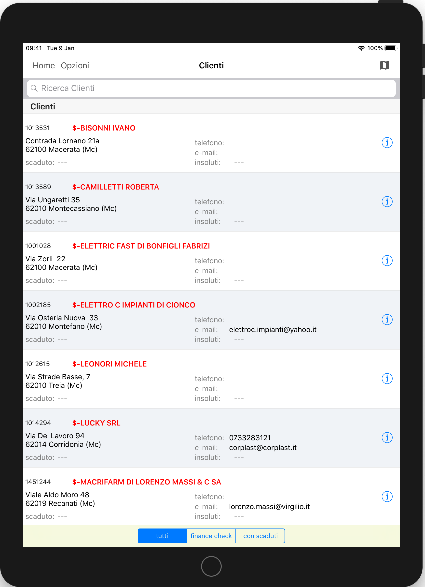

# Test

### Kimo Server

1. Windows Server 2008R2 / 2012 / 2012R2 / 2016
2. Internet Information Service role \(IIS\)
3. Microsoft .Net Framework 4.6
4. Microsoft Message Queue feature
5. MongoDB

Immagine diretta

Immagine embeddata



### Kimo Server

1. Windows Server 2008R2 / 2012 / 2012R2 / 2016
2. Internet Information Service role \(IIS\)
3. Microsoft .Net Framework 4.6
4. Microsoft Message Queue feature
5. MongoDB

{% embed url="https://kimostorage.blob.core.windows.net/kimomanual/Images/Test%20Camtasia%201f.mp4" %}

### Kimo Server

1. Windows Server 2008R2 / 2012 / 2012R2 / 2016
2. Internet Information Service role \(IIS\)
3. Microsoft .Net Framework 4.6
4. Microsoft Message Queue feature
5. MongoDB

{% embed url="https://kimostorage.blob.core.windows.net/kimomanual/Images/Test%20Camtasia%201e.mp4" %}

fwerew

werwe

r

ewr

wer

werw

